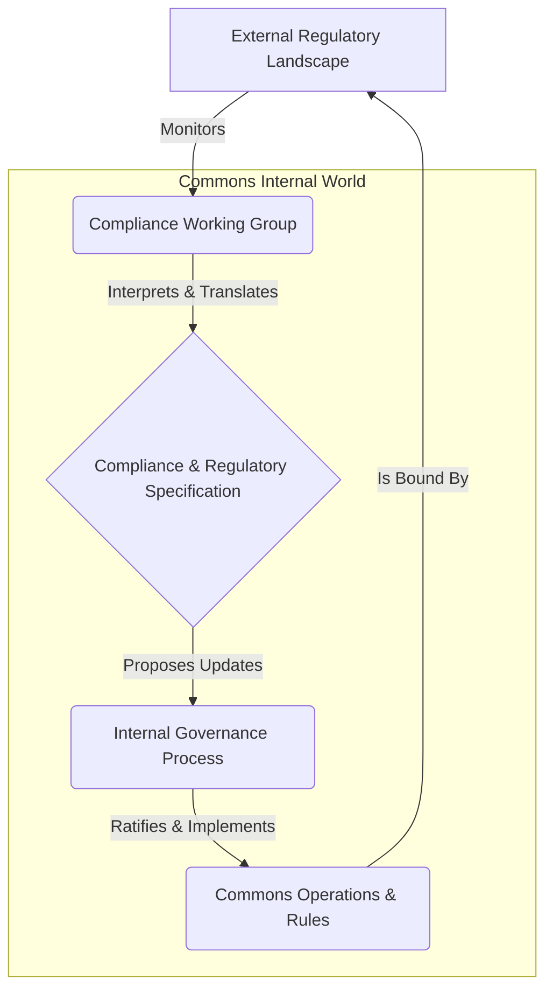

---
# ═══════════════════════════════════════════════════════════════════
# GROUP 0: ARCHITECTURAL POSITION (The Gravity Well)
# ═══════════════════════════════════════════════════════════════════
orbital_layer: 2
sector: "Universal"
gravitational_hubs: []
id: pat_01khm0p9qqk35t0686sg911f5a
slug: compliance-and-regulatory-specification
title: Compliance & Regulatory Specification
aliases:
- Regulatory Framework Integration
- Legal Adherence Protocol
- Compliance Blueprint
summary: A pattern for systematically defining, tracking, and integrating external legal and regulatory requirements into a commons' operational and governance frameworks.
context_labels:
  corporate: Corporate Compliance Management
  government: Public Sector Regulatory Adherence
  activist: Legal Framework for Action
  tech: RegTech Integration Strategy
  community: Community Bylaw and Legal Standing
ontology:
  domain: governance
  cross_domains:
  - legal
  - finance
  - technology
  commons_domain:
    - commons-engineering
  specification_layer: L5
  search_hints:
    primary_tension: External Constraint vs. Internal Autonomy
    vector_keywords:
    - regulation
    - compliance
    - legal
    - governance
    - risk
    - auditing
    - policy
    - standards
  commons_assessment:
    stakeholder_architecture: 4
    value_creation: 3
    resilience: 5
    ownership: 3
    autonomy: 2
    composability: 4
    fractal_value: 3
    vitality: 3.5
    vitality_reasoning: >-
      This pattern is sustaining because it creates the necessary stability and safety for the commons to thrive amidst a complex external world. By translating rigid external rules into an adaptable internal process, it protects the organization's core mission from legal threats. While it can become overly bureaucratic, at its best it allows the commons to maintain its focus and resilience.
    overall_score: 3.4
lifecycle:
  usage_stage: design
  adoption_stage: mature
  status: draft
  version: 1.0
  confidence: 3
relationships:
  generalizes_from:
  - commons-blueprint
  specializes_to: []
  enables:
  - id: governance-design
    weight: 0.7
    description: Provides the necessary external constraints and requirements that must be incorporated into any robust governance design.
  requires:
  - id: governance-design
    weight: 0.8
    description: A formal governance structure is necessary to interpret, implement, and monitor compliance with the specified regulations.
  alternatives: []
  complementary: []
graph_garden:
  last_pruned: '2026-02-16'
  entities:
  - Mondragon
  - Resilience
  communities:
  - organization-and-culture
  - value-and-strategy
  inferred_links: []
contributors:
- higgerix
- cloudsters
license: CC-BY-SA-4.0
attribution: commons.engineering by cloudsters
provenance:
  contributors:
  - higgerix
  - cloudsters
---

### 1. Context

Any commons, regardless of its domain, does not exist in a vacuum. It operates within a complex web of legal jurisdictions, industry standards, and societal expectations. This is not a dead machine but a living ecosystem of rules that co-evolves with society. A tech cooperative building a new platform must navigate data privacy laws like GDPR. An urban garden commons must adhere to local zoning ordinances and environmental regulations. A financial commons is subject to strict anti-money laundering (AML) and securities laws. This external legal and regulatory landscape is not static; it is constantly evolving, breathing with the pulse of political and social change. New laws are passed, existing ones are amended, and judicial interpretations shift. For a commons to endure and thrive, it cannot afford to be ignorant of these powerful external forces. Ignoring them can lead to legal challenges, financial penalties, loss of legitimacy, and even the dissolution of the commons itself, extinguishing its unique spark. Therefore, every practitioner and steward of a commons faces the challenge of understanding this landscape and ensuring the organization's activities remain within its bounds, finding a way to dance with this external rhythm.

### 2. Problem

> **The core conflict is External Constraint vs. Internal Autonomy.**

A commons is founded on the principle of self-governance and autonomy, allowing its members to define their own rules and operational logic—the very source of its creative life. However, it must simultaneously coexist with and adhere to external, non-negotiable rules imposed by state actors and regulatory bodies. This creates a fundamental tension between the desire for internal freedom and the necessity of external compliance. When this tension is poorly managed, the commons can feel a creeping paralysis, a loss of the very agency that defines it. The specific forces at play are:

1.  **Force 1: The Need for Legitimacy.** To be taken seriously and to operate without interference, a commons must be perceived as a legitimate and law-abiding entity by external authorities, partners, and the public. This requires demonstrating a clear commitment to compliance, showing that its internal life is not a threat to the surrounding world.
2.  **Force 2: The Burden of Complexity.** The regulatory landscape is often vast, fragmented, and written in specialized language that is inaccessible to non-experts, feeling like a dead weight. A single commons may be subject to dozens of regulations from local, national, and international bodies, creating a significant cognitive and administrative burden that can drain its vitality.
3.  **Force 3: The Risk of Obsolescence.** Laws and regulations change. A compliance strategy that is robust today may be inadequate tomorrow. The commons needs a dynamic process to track these changes and adapt its internal rules and processes accordingly, without constantly overhauling its core structure and losing its living memory.
4.  **Force 4: The Desire for Mission Focus.** The primary purpose of a commons is to create value for its members, not to become a legal-auditing entity. Over-investing in compliance can divert precious resources—time, money, and attention—away from the core mission, leaving a void where the system's soul should be.

### 3. Solution

> **Therefore, create a formal and living Compliance & Regulatory Specification that acts as a bridge between the external legal landscape and the internal governance of the commons.**

This specification is not merely a static document but a dynamic system, a semi-permeable membrane that allows the commons to breathe. It translates abstract legal requirements into concrete, actionable rules and operational parameters that can be understood and implemented by the members of the commons. It functions as a continuously updated map of the legal territory the commons must navigate, ensuring the organization doesn't get lost in a legalistic desert. The core mechanism involves establishing a dedicated working group or role responsible for maintaining the specification. This group monitors the regulatory environment, interprets changes, and proposes updates to the specification. These updates are then ratified through the commons' established governance process, ensuring that compliance remains aligned with the collective will and the system as a whole feels coherent and alive.

This solution resolves the conflicting forces by creating a dedicated interface for the problem. It isolates the complexity of the legal world into a specialized function (the working group), which then produces a clear, structured output (the specification) that the rest of the commons can easily consume. This allows the commons to maintain its internal autonomy and focus on its mission, ensuring that its operations remain legitimate and resilient to external shocks, and that its inner life can continue to flourish.

### 4. Implementation

Implementing a Compliance & Regulatory Specification requires a systematic approach. The goal is to create a process that is both rigorous and adaptable, a living rhythm rather than a rigid, bureaucratic straitjacket that stifles creativity.

1.  **Establish a Compliance Working Group:** The first step is to identify a small, dedicated group of individuals (or a single individual in a smaller commons) responsible for this pattern. This group does not need to be composed of lawyers, but should include members with strong analytical skills, attention to detail, and the ability to translate complex text into clear, living language. Their mandate is to own and maintain the specification, to be the stewards of this vital connection.

2.  **Conduct an Initial Regulatory Audit:** The working group's first task is to map the commons' current regulatory landscape. This involves identifying all relevant jurisdictions (local, national, international) and the key pieces of legislation, regulation, and standards that apply to the commons' specific activities. This audit will form the baseline for Version 1.0 of the specification, the first snapshot of the ecosystem.

3.  **Structure the Specification Document:** The specification should be a clear, well-structured document. A good practice is to organize it by regulatory domain (e.g., Data Privacy, Financial Reporting, Employment Law). For each regulation, the specification should include:
    *   A plain-language summary of the regulation's core requirements.
    *   The specific operational activities within the commons that are affected.
    *   The concrete rules or procedures the commons must follow to ensure compliance.
    *   The person or role responsible for overseeing compliance with that specific rule.
    *   A link to the original legal text for reference.

4.  **Integrate with Governance:** The specification is not a standalone policy; it must be woven into the living fabric of the commons' governance. Create a formal process for the working group to submit proposed changes to the specification. These changes should be reviewed and ratified by the appropriate decision-making body within the commons, ensuring democratic oversight and a sense that the rules are owned by the community.

5.  **Establish a Monitoring Process:** The working group must establish a system for monitoring regulatory changes. This can involve subscribing to legal newsletters, using regulatory intelligence services, or simply setting calendar reminders to periodically review government and agency websites. The key is to make this a proactive, recurring process, a continuous sensing of the environment, not a reactive one.

**Common Pitfalls:**
*   **Over-engineering:** The specification should be as simple as possible while still being effective. Avoid creating a complex bureaucratic maze that no one can navigate, which would be a ghost in the machine of the commons.
*   **Lack of Buy-in:** If the members of the commons do not understand or respect the specification, it will be ignored. The integration with the governance process is crucial for building legitimacy and ensuring practitioners feel agency and belonging.
*   **Stagnation:** The specification must be a living document. If the monitoring process fails and the document becomes outdated, it becomes worse than useless—it creates a false sense of security, a dangerous illusion of life.

### 5. Consequences

**Benefits:**
*   **Enhanced Resilience:** By systematically tracking and adapting to the legal environment, the commons dramatically reduces its risk of legal challenges, fines, or shutdowns. It can anticipate changes and adapt proactively, rather than reacting in a crisis, demonstrating the adaptive capacity of a living system.
*   **Increased Legitimacy:** A formal, transparent compliance process demonstrates maturity and trustworthiness to external partners, funders, and regulatory agencies, opening up new opportunities for collaboration and growth. The system breathes confidence.
*   **Improved Focus:** By isolating the complex work of compliance within a dedicated function, the broader community is freed to focus on the core mission of creating value. It reduces the cognitive overhead for the average member, allowing their creative energies to flow where they are most needed.

**Liabilities:**
*   **Risk of Centralization:** The Compliance Working Group, by virtue of its specialized knowledge, can become a powerful bottleneck or a source of centralized authority. It is crucial to ensure they are accountable to the broader governance process and that their role is one of translation, not dictation, preventing the emergence of a rigid, controlling nerve center.
*   **Bureaucratic Drag:** If not managed carefully, the process of updating and ratifying the specification can become slow and cumbersome, hindering the commons' ability to adapt quickly and respond to new opportunities with agility.

**When NOT to use this pattern:**
This pattern is likely overkill for a very small, informal commons with minimal external interaction (e.g., a neighborhood book-sharing club). In such cases, an informal understanding of the rules is sufficient. However, as soon as a commons begins to handle money, manage personal data, employ people, or own property, the risk of non-compliance becomes significant, and a more formal approach is warranted to protect its nascent life.

### 6. Known Uses

1.  **Stripe (Fintech):** As a global payment processor, Stripe operates in one of the most complex regulatory environments in the world, covering financial services, data privacy, and international trade law. Stripe's solution is a textbook example of this pattern. They maintain a massive, dedicated legal and compliance team that creates and continuously updates a detailed internal specification. This specification is then translated into the automated rules and logic of their platform, giving the system a coherent, adaptive pulse. For example, their KYC (Know Your Customer) and AML (Anti-Money Laundering) obligations are not just policies; they are hard-coded into the user onboarding and transaction monitoring systems, a direct implementation of a living regulatory specification.

2.  **Siemens Healthineers (Medical Technology):** In the medical device industry, compliance with bodies like the U.S. Food and Drug Administration (FDA) is paramount. Siemens Healthineers, a leading manufacturer of medical imaging and diagnostic equipment, implements this pattern through a rigorous Quality Management System (QMS). Their QMS is a detailed specification that translates FDA regulations (such as 21 CFR Part 820) into concrete design controls, manufacturing processes, and post-market surveillance procedures. This specification is a living document, constantly updated to reflect new guidance and regulations, ensuring that every device they produce meets the highest standards of safety and efficacy, embodying a deep responsibility for the lives it touches.

3.  **Mondragon Corporation (Cooperative Federation):** Mondragon, a federation of worker cooperatives in Spain, operates across numerous industries, from manufacturing to finance to retail. Their compliance is managed through a combination of a central legal team and the autonomy of individual cooperatives. The central body provides a baseline specification of Spanish and EU law (labor law, tax law, environmental regulations). Each member cooperative then adapts and implements this specification within its own unique governance structure, as defined by its own bylaws. This demonstrates a fractal application of the pattern, where a high-level specification is adapted and implemented by autonomous, self-governing units, allowing for a healthy diversity within a unified, living whole.

### 7. The Future of this Pattern

In the cognitive era, the Compliance & Regulatory Specification pattern is poised for a radical transformation from a human-driven process to a human-AI hybrid system. The manual, labor-intensive aspects of the pattern can be largely automated, freeing up human capacity for higher-level judgment and strategic decision-making, allowing the human spirit to focus on what it does best.

AI agents can be deployed to continuously scan the global regulatory landscape in real-time. These agents can monitor government gazettes, court rulings, and regulatory agency updates across multiple jurisdictions, far exceeding the capacity of any human team. Using Natural Language Processing (NLP), they can parse complex legal text, identify changes, and perform an initial impact analysis, flagging which parts of the commons' operations are likely to be affected. For example, an AI could detect a change in a data residency law and automatically identify the specific data storage systems and processes that need to be reviewed, acting as the sensory organs of the commons.

The specification document itself can become a dynamic, machine-readable object. Instead of a text file, it could be a knowledge graph where regulations, rules, and operational controls are represented as interconnected nodes. When an AI detects a regulatory change, it can automatically propose an update to the graph, showing the new dependencies and potential conflicts. This allows the Compliance Working Group to visualize the impact of changes instantly, rather than manually tracing dependencies through a static document, creating a shared, living understanding.

The future of this pattern lies in a sophisticated human-AI partnership, a form of symbiosis. AI agents will handle the exhaustive work of monitoring and initial analysis. The human working group will then validate the AI's findings, handle the edge cases and ambiguities that require human judgment, and, most importantly, facilitate the social and political process of integrating the necessary changes into the commons. The role of the human becomes that of the "auditor of the automaton," the ethical backstop, and the bridge between the logic of the code and the values of the community, ensuring the system retains its soul.

### 8. Vitality: The Quality Without a Name

When the Compliance & Regulatory Specification pattern is truly alive, it feels less like a set of constraints and more like a dance. Practitioners within the commons don't experience the law as a source of fear or a bureaucratic burden, but as a known landscape they can navigate with confidence and grace. There is a palpable sense of agency; the rules are not alien impositions but are understood, integrated, and even owned by the community. The system breathes. When a new regulation appears on the horizon, the response is not panic, but a calm, focused process of inquiry and adaptation. The Compliance Working Group acts as the commons' immune system, identifying external changes and skillfully integrating them into the body of the organization without causing inflammation or rejection. The organization as a whole develops a kind of muscle memory for adaptation, making it resilient and antifragile. It can handle the unexpected not by being rigid, but by being flexible and responsive, secure in its foundation.

Conversely, decay in this pattern manifests as a creeping lifelessness. The first sign is often fragmentation—the specification becomes an ignored document, a ghost in the machine, while actual practice diverges into a series of ad-hoc, undocumented workarounds. Practitioners feel a growing sense of anxiety and uncertainty, never quite sure if they are on solid ground. The language of compliance becomes a jargon-filled code spoken only by a select few, creating a chasm between the "experts" and the rest of the community. The system loses its ability to learn; it becomes brittle, reacting to regulatory shifts with disruptive, last-minute fire drills rather than smooth adjustments. This rigidity is a sign that the commons is losing its connection to its environment, becoming a closed system that is slowly suffocating, lacking the living memory to handle novelty. The soul of the commons begins to wither, replaced by a hollow shell of formal procedures that no one truly believes in.
