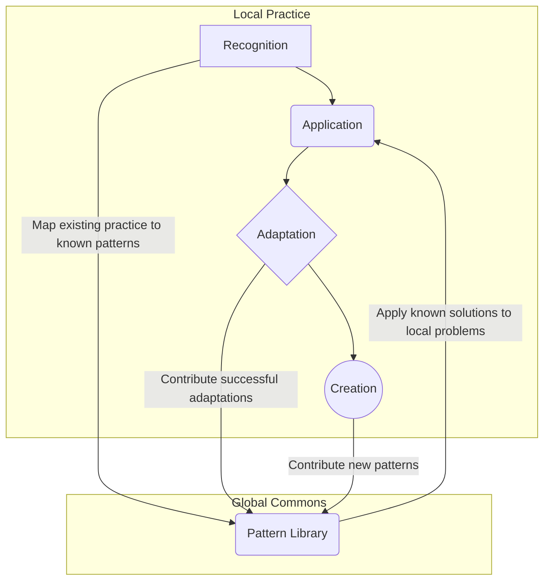

---
# ═══════════════════════════════════════════════════════════════════
# GROUP 0: ARCHITECTURAL POSITION (The Gravity Well)
# ═══════════════════════════════════════════════════════════════════
orbital_layer: 2
sector: "Universal"
gravitational_hubs: []
id: pat_01khm0cg76vr2e6wgj06mtm91b
slug: pattern-lifecycle
title: Pattern Lifecycle
aliases:
- Pattern Evolution
- Knowledge Lifecycle Management
- Practice to Pattern Pipeline
summary: A meta-pattern for how a system discovers, codifies, shares, and evolves its own operational patterns, creating a continuous loop between local practice and globally shared knowledge.
context_labels:
  corporate: Best Practice Management
  government: Policy Lifecycle Framework
  activist: Movement Playbook Evolution
  tech: Design Pattern Governance
ontology:
  domain: governance
  cross_domains:
  - knowledge_management
  - organizational_design
  commons_domain:
    - commons-engineering
  specification_layer: L4
  search_hints:
    primary_tension: Knowledge Hoarding vs. Collective Intelligence
    vector_keywords:
    - pattern
    - lifecycle
    - evolution
    - adaptation
    - knowledge management
    - best practice
    - innovation
  commons_assessment:
    stakeholder_architecture: 4
    value_creation: 5
    resilience: 4
    ownership: 3
    autonomy: 3
    composability: 5
    fractal_value: 5
    vitality: 4.8
    vitality_reasoning: >-
      This pattern is generative because it creates the conditions for a system to learn, adapt, and evolve. It is the meta-process by which a collective intelligence comes alive and stays alive, turning inert knowledge into a vibrant, self-renewing ecosystem.
    overall_score: 4.2
lifecycle:
  usage_stage: design
  adoption_stage: growth
  status: draft
  version: 1.0
  confidence: 3
relationships:
  generalizes_from:
  - commons-blueprint
  specializes_to: []
  enables:
  - id: adaptive-learning
    weight: 0.8
    description: Pattern evolution is a form of organizational learning.
  requires:
  - id: transformation-sequencing
    weight: 0.7
    description: Transformation creates new patterns and retires old ones.
  alternatives: []
  complementary: []
graph_garden:
  last_pruned: '2026-02-16'
  entities:
  - Christopher Alexander
  - Scrum
  - Commons Engineering
  - Feedback Loop
  - Resilience
  communities:
  - capability-and-structure
  - technology-and-infrastructure
  inferred_links:
  - target: commons-blueprint
    reason: 'Shared entities: Feedback Loop, Commons Engineering, Resilience'
    strength: 3
  - target: self-organization-and-subsidiarity
    reason: 'Shared entities: Scrum, Feedback Loop, Resilience'
    strength: 3
contributors:
- higgerix
- cloudsters
license: CC-BY-SA-4.0
attribution: commons.engineering by cloudsters
provenance:
  contributors:
  - higgerix
  - cloudsters
---

### 1. Context

Every organization, from a startup to a government agency, runs on patterns. These are the recurring solutions to recurring problems—how a team runs a meeting, how a developer deploys code, how a community resolves conflict. These patterns form the living tissue of an organization's operational body. Most of these patterns are used unconsciously, adopted through imitation or necessity without being named or formally recognized. A team might adopt practices from Scrum without ever calling it that, or a company might build a customer feedback loop that mirrors the 'Voice of the Customer' pattern. This unconscious use is effective to a point, but it has a low ceiling. When patterns are not explicitly identified, they cannot be deliberately improved, shared across the organization, or adapted with precision. The system lacks the self-awareness to heal and regenerate itself. Knowledge remains siloed in teams and individuals, leading to constant reinvention of the wheel and a kind of organizational amnesia. Worse, when organizations do codify their successful patterns, they often treat them as proprietary assets to be hoarded, stifling both internal innovation and broader collective intelligence, causing the system's arteries to harden.

### 2. Problem

> **The core conflict is Knowledge Hoarding vs. Collective Intelligence.**

This tension manifests through several competing forces that pull organizations in opposite directions, preventing them from realizing the full value of their operational wisdom. It is a struggle between the forces of enclosure and the forces of flow, between the dead hand of control and the generative dance of a living system.

1.  **Local Relevance vs. Universal Applicability.** To be effective, a pattern must be tailored to the specific context of a team or project. A sales process for enterprise software looks different from one for a direct-to-consumer product. However, if these local adaptations remain isolated, the universal principles are lost, like nutrients that never reach the whole organism. The organization fails to learn from its own experiments, and the core pattern never improves from the feedback of its diverse applications. The push for immediate, local utility obstructs the pull toward creating robust, universally applicable knowledge assets that form the organization's living memory.

2.  **Discovery vs. Invention.** The most powerful patterns are typically discovered, not invented. They are recognized as successful, recurring behaviors already happening within the system—the system breathing, its heart beating. Yet, organizations often lack the language and frameworks to *see* what they are already doing. Instead, they focus on inventing new processes from scratch, a far more costly and less reliable endeavor. This creates a force that favors expensive, top-down invention over the more organic, bottom-up discovery of what already works, leaving valuable institutional knowledge untapped and practitioners feeling disconnected from the system's soul.

3.  **Intellectual Property vs. Open Innovation.** When an organization invests in developing a unique and valuable process, the natural inclination is to protect it as a trade secret or intellectual property. This provides a competitive advantage. However, this hoarding instinct directly conflicts with the principles of open innovation and collective intelligence. By keeping patterns proprietary, the organization cuts itself off from external feedback, improvements, and the network effects that come from contributing to a shared commons of knowledge. The desire for a defensible moat works against the need for a vibrant, collaborative ecosystem where knowledge can flow and cross-pollinate, creating new forms of life.

### 3. Solution

> **Therefore, establish a continuous, four-phase lifecycle for patterns—Recognition, Application, Adaptation, and Creation—to systematically evolve collective knowledge from individual practice.**

This lifecycle creates a dynamic, learning-oriented system that resolves the tension between hoarding and sharing. It provides a structured pathway for knowledge to flow from local, contextual practice to a global, shared commons and back again, like the circulatory system of a living organism. The mechanism is not a rigid, linear process but a continuous, fractal loop that can be entered at any point, allowing the system to breathe.

**1. Recognition:** The first phase is about developing situational awareness and a felt sense for the system. It involves identifying and naming the patterns an organization is *already* using, whether consciously or not. This is diagnostic work, akin to a doctor identifying a patient's underlying physiological patterns. Practitioners are trained to observe workflows, decision-making processes, and communication structures, and map them to known patterns from the shared library (the global commons). This act of naming transforms unconscious competence into explicit knowledge, making it visible, discussable, and available for deliberate improvement. It is the moment the system begins to see itself.

**2. Application:** Once a shared vocabulary exists, the organization can move to deliberate application. When a new challenge arises, teams don't have to start from a blank slate. They can consult the pattern library to find proven solutions to similar problems, drawing nourishment from the collective wisdom. This is where the commons provides immediate, practical value, saving countless hours of reinvention. Applying a known pattern, such as "Stakeholder Mapping" or "Consent-Based Decision Making," provides a robust starting point that has been tested and refined across many contexts, giving practitioners a sense of agency and belonging.

**3. Adaptation:** No universal pattern fits every local context perfectly. The third phase, Adaptation, is the crucial step of modifying a global pattern to meet specific local needs. This is where the system shows its adaptive capacity. A "Value Stream Mapping" pattern will be adapted differently for a software company versus a hospital. These adaptations are experiments. The key is to track the modification and its outcome. Successful adaptations become valuable local knowledge and are candidates for being contributed back to the commons, enriching the original pattern with a new variant or a set of implementation considerations, allowing the global pattern to evolve.

**4. Creation:** Occasionally, a team confronts a problem for which no known pattern exists. Through experimentation, they may develop a genuinely novel solution that proves effective and repeatable. This is the Creation phase—the discovery of a new pattern, a moment of emergence. When this happens, the lifecycle provides a pathway for this new knowledge to be shared. The team documents the context, problem, and solution, and submits it to the commons as a candidate pattern. This contribution is the lifeblood of the system, ensuring the pattern library is not a static archive but a living, evolving body of collective intelligence.

### 4. Implementation

Implementing a pattern lifecycle requires a deliberate investment in tools, skills, and culture. It is not a one-off project but a continuous organizational practice, a cultivation of the organizational garden. The following steps provide a roadmap for establishing this capability.

1.  **Establish a Central Pattern Repository:** The foundation of the lifecycle is a shared, accessible library. This can be as simple as a version-controlled repository of Markdown files (like the Commons Engineering blueprint) or a more sophisticated wiki or knowledge management system. The key is that it must be the single source of truth for all patterns, with clear versioning and contribution guidelines. This repository becomes the heart of the system, pumping knowledge to where it's needed.

2.  **Develop Recognition Capability:** Practitioners cannot recognize patterns they don't know. Invest in training and literacy. This can include workshops, reading groups, and pairing experienced "pattern spotters" with teams. Create simple tools, like checklists or diagnostic canvases, that help teams map their current activities to the pattern language. The goal is to make "pattern thinking" a natural part of every team's retrospective and design process, giving them the eyes to see the life within their own work.

3.  **Integrate with Existing Workflows:** The pattern lifecycle should not be a separate, bureaucratic process. It must be embedded into the tools and rituals teams already use, flowing naturally within the organization's daily rhythms. For example, a project management tool could have a field to link tasks to the patterns they implement. A design review process should include a step to identify which patterns are being applied or adapted. The contribution of a new pattern should be as lightweight as a pull request.

4.  **Create a Contribution Pipeline:** There must be a clear, transparent process for adapting and creating patterns. This is not about centralized control but about quality assurance and coherence, ensuring the health of the knowledge ecosystem. A typical pipeline involves:
    *   **Staging:** A new pattern or adaptation is submitted to a staging area where it can be reviewed.
    *   **Validation & Enrichment:** An editorial team (or a community of peers) reviews the submission for clarity, accuracy, and proper formatting. They may enrich it with better examples or connections to other patterns.
    *   **Promotion:** Once it meets the quality bar, the pattern is promoted to the main library.

5.  **Incentivize Participation:** Contributing to the pattern commons requires effort. Organizations must create incentives that reward this work, fostering a culture of generosity. This can include public recognition, making contributions a factor in performance reviews, or allocating dedicated time for knowledge management. The most powerful incentive is creating a system that is so useful and alive that people *want* to contribute to make it even better.

**Key Considerations:**

*   **Start Small:** Don't try to boil the ocean. Begin with a single, high-value domain and a small group of enthusiastic practitioners. Let the system grow organically as it proves its worth, like a seed sprouting in fertile ground.
*   **Balance Governance and Freedom:** The contribution pipeline needs some oversight to maintain quality, but too much bureaucracy will stifle participation. Use automated checks for formatting and structure, and focus human review on the quality of the ideas. The goal is to be a good gardener, not a micromanager.
*   **Human and Machine Curation:** Leverage AI to suggest connections, identify duplicates, and assist in enrichment, but always keep a human in the loop for final validation. The goal is a partnership between human insight and machine scale, a cyborg approach to collective sensemaking.

**Common Pitfalls:**

*   **The "Empty Library" Problem:** A pattern library with no content is useless, a sterile environment devoid of life. Seed the library with a critical mass of high-quality, relevant patterns before launching the initiative broadly.
*   **Confusing Adaptation with Creation:** Most local modifications are adaptations of existing patterns, not the creation of entirely new ones. A clear process helps differentiate the two, preventing the library from being flooded with near-duplicates and becoming a tangled mess.
*   **Extraction without Reciprocity:** If teams only consume patterns without ever contributing back their adaptations and discoveries, the system stagnates and withers. The social contract must emphasize the importance of giving back to the commons, completing the circulatory flow of knowledge.

### 5. Consequences

Adopting a formal pattern lifecycle transforms an organization's relationship with its own knowledge, turning tacit wisdom into a dynamic, improvable asset. It is the difference between a static blueprint and a living, breathing organism. However, this transformation comes with both significant advantages and new responsibilities.

**Benefits:**

*   **Transforms Unconscious Practice into Deliberate Strategy:** By giving names and structures to what was previously intuitive or informal, the organization can now manage its core processes as a portfolio of strategic assets. This enables more rigorous analysis, targeted improvement, and consistent execution across the board. The system develops a coherent identity and purpose.
*   **Resolves the IP-vs-Sharing Dilemma:** The pattern lifecycle offers a structural solution to the tension between proprietary knowledge and open collaboration. The core patterns are treated as an open, internal commons, while the competitive advantage shifts to the organization's superior ability to *apply* and *adapt* these patterns in its unique context. The organization thrives not by hoarding, but by its superior capacity for flow and adaptation.

**Liabilities:**

*   **Requires Investment in Literacy and Governance:** This is not a free lunch. The benefits of a pattern lifecycle are only realized with a sustained investment in training practitioners to recognize and use patterns, as well as governing the contribution pipeline to ensure quality and coherence. Without this, the library can quickly become a neglected, untrusted archive, a ghost in the machine.
*   **Can Introduce Bureaucratic Drag:** If the contribution and validation process is too rigid or slow, it can discourage participation and suck the life out of the initiative. The governance model must be carefully designed to be as lightweight as possible, balancing the need for quality with the need for speed and agility.
*   **Initial Focus on Codification Over Action:** In the early stages, there is a risk that teams may spend more time documenting and debating patterns than applying them to solve real-world problems. The focus must always be on the practical application of knowledge, with codification as a supporting activity. The map is not the territory, and the pattern is not the practice.

**When NOT to use this pattern:**

This pattern is not a universal solution. It is ill-suited for situations of extreme urgency where immediate, decisive action is required and there is no time for analysis or reflection. In a crisis, it is better to act first and use the pattern lifecycle retroactively to analyze the actions taken and capture any emergent lessons. It is also less valuable for tasks that are genuinely unique and non-recurring, as the overhead of pattern identification and codification would yield little return on investment. It is a tool for cultivation, not for emergencies.

### 6. Known Uses

The concept of a pattern lifecycle, though not always named as such, has been a powerful driver of innovation and quality in several domains. It appears wherever a community or organization commits to systematically learning from its own experience, creating a living tradition.

1.  **Christopher Alexander's Pattern Language (Architecture & Urban Planning):** The origin of the pattern language movement is the most direct application of this lifecycle. Christopher Alexander and his team at the Center for Environmental Structure did not invent the 253 patterns in their seminal work, *A Pattern Language: Towns, Buildings, Construction* [1]. Instead, they **recognized** them by studying beloved, human-centric places that felt alive. They **codified** them into a shared language that others could **apply** and **adapt**. The book itself is an invitation to **create** new patterns and evolve the language. The entire project was an explicit attempt to create a living, shared repository of architectural knowledge, moving the field from the sole genius of the star architect to a collective intelligence accessible by all.

2.  **The Toyota Production System (TPS) (Manufacturing):** The TPS is one of the most successful examples of a corporate pattern language. Toyota did not hoard its revolutionary production methods. Instead, it actively taught them to its suppliers and even competitors, creating a learning ecosystem. Through initiatives like the Toyota Supplier Support Center, they **recognized** best practices on their factory floors, **codified** them into principles like *Jidoka* (automation with a human touch) and *Just-in-Time*, and created a system for suppliers to **apply** and **adapt** them. New discoveries and adaptations were fed back into the system, continuously improving the TPS. This open, learning-based approach, a stark contrast to the IP hoarding of competitors, is widely credited with the extraordinary resilience and efficiency of Toyota's supply chain [2].

3.  **Software Design Patterns (Technology):** The software industry was one of the first to see the power of Alexander's work. The "Gang of Four" book, *Design Patterns: Elements of Reusable Object-Oriented Software*, applied the pattern concept to software engineering. It **recognized** and **codified** 23 common solutions to programming challenges. This gave developers a shared vocabulary and a set of proven solutions to **apply**. The culture of open-source software has created a massive, decentralized pattern lifecycle. Developers constantly **adapt** existing patterns in their projects and **create** new ones, sharing them through blogs, conference talks, and code repositories like GitHub. This distributed, informal, yet highly effective lifecycle is a primary engine of progress in the software world, a testament to the power of shared knowledge in a living system.

### 7. Cognitive Era Considerations

The advent of the cognitive era, powered by large language models and autonomous agents, radically accelerates every phase of the pattern lifecycle. What was once a slow, human-driven process of scholarship and curation can now become a dynamic, real-time partnership between human practitioners and their AI counterparts. The lifecycle's core loop remains the same, but its velocity and scale are amplified by orders of magnitude, making the system more responsive and alive.

**Automation and Augmentation:**

*   **Recognition on Steroids:** AI agents are exceptionally suited for the **Recognition** phase. They can be tasked to scan an organization's entire digital footprint—code repositories, project management boards, chat logs, and documents—to identify instances of known patterns. An agent could analyze a company's sales data and communication, and report: "This team is unconsciously using a variant of the 'Consultative Selling' pattern with 80% fidelity. Here are the deviations." This gives the organization real-time visibility into its own nervous system.

*   **Intelligent Application:** In the **Application** phase, agents act as expert consultants. A human practitioner can describe a problem in natural language, and an agent can search the global pattern library, retrieve the most relevant patterns, and even generate a preliminary implementation plan. This turns the pattern library from a passive archive into an interactive diagnostic and prescriptive tool, a true partner in creation.

*   **Assisted Adaptation and Creation:** When a pattern is **Adapted** or a new one is **Created**, agents can act as tireless collaborators. They can help draft the pattern documentation, generate diagrams, find supporting evidence from public data, and even suggest connections to other patterns in the library that the human author may have missed. The `graph_garden` in the v7 frontmatter is designed to be a space for these machine-inferred relationships, mapping the evolving web of knowledge.

**New Risks and Human Judgment:**

*   **The Risk of Hallucinated Patterns:** A significant new risk is that AI agents may "hallucinate" patterns, identifying seemingly coherent but ultimately spurious correlations in data. This is a ghost in the machine that can lead the system astray. Human judgment remains critical to validate a pattern's authenticity and utility. The final decision to adopt a pattern into the commons must remain a human one.

*   **Bias Amplification:** If the data an AI learns from contains biases, the patterns it recognizes and suggests will amplify those biases. For example, if an agent is trained on project data where only certain demographics are assigned leadership roles, it may codify this bias into a "Leadership Assignment" pattern. Continuous human oversight and algorithmic auditing are essential to ensure the system's health and fairness.

*   **The Future of Work:** As agents take on more of the codification and discovery work, the role of the human practitioner shifts from being a pattern author to a pattern strategist and ethicist. The most valuable human skills will be the ability to ask the right questions, critically evaluate the patterns suggested by AI, and make wise decisions about which patterns to cultivate and which to discard. Humans become the gardeners of the AI-augmented mind.

### 8. Vitality: The Quality Without a Name

When the Pattern Lifecycle is truly working, it infuses an organization with a palpable sense of life. It’s the feeling of being part of a system that is learning, growing, and becoming more whole. Practitioners feel a sense of agency and belonging, knowing they are not just cogs in a machine but active participants in an evolving intelligence. There is a buzz in the air, a feeling of shared purpose and effortless coordination. When faced with the unexpected, the system doesn’t break; it adapts. New challenges are met with curiosity and a quiet confidence, born from the knowledge that the collective has a deep well of wisdom to draw upon. The organization feels less like a rigid structure and more like a living organism, one that can sense its environment, metabolize experience into knowledge, and regenerate itself from within. Information flows freely, like breath, nourishing every part of the whole.

Conversely, when this pattern is failing, a sense of decay and lifelessness sets in. The system becomes rigid and brittle. The same mistakes are made over and over, a sign of organizational amnesia. There is a void where the system’s soul should be. Practitioners feel disengaged, their local knowledge ignored and their creativity stifled by top-down mandates. The "Empty Library" problem is a clear warning sign—a knowledge repository that is a graveyard of dead documents, not a vibrant, living commons. Another signal is the feeling of bureaucratic drag, where the process of sharing knowledge becomes so onerous that people stop trying. The system ceases to breathe, its arteries clogged with outdated processes and hoarded information. It becomes a ghost in the machine, a collection of parts that no longer form a coherent, living whole.

### References

[1] Alexander, C., Ishikawa, S., & Silverstein, M. (1977). *A Pattern Language: Towns, Buildings, Construction*. Oxford University Press.

[2] Dyer, J. H., & Nobeoka, K. (2000). Creating and managing a high-performance knowledge-sharing network: The Toyota case. *Strategic Management Journal*, *21*(3), 345-367.
