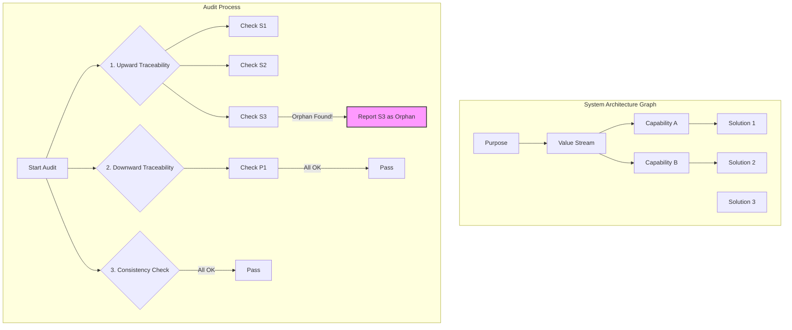

---
# ═══════════════════════════════════════════════════════════════════
# GROUP 0: ARCHITECTURAL POSITION (The Gravity Well)
# ═══════════════════════════════════════════════════════════════════
orbital_layer: 2
sector: "Universal"
gravitational_hubs: []
id: pat_01khm0gsxdnyt0c9xy891kz00e
slug: structural-integrity-audit
title: Structural Integrity Audit
aliases:
- Architecture Compliance Review
- System Coherence Check
- Structural Verification
summary: A periodic, in-depth review to verify that a system's components and their relationships remain aligned with its documented architecture and underlying purpose, detecting drift and ensuring long-term
  viability.
context_labels:
  corporate: Architecture Compliance Audit
  government: Regulatory & Policy Conformance Review
  activist: Mission & Values Alignment Audit
  tech: System Dependency & Architectural Health Check
  community: Constitutional Integrity Review
ontology:
  domain: governance
  cross_domains:
  - systems-thinking
  - architecture
  - quality-assurance
  commons_domain:
    - commons-engineering
  specification_layer: L5
  search_hints:
    primary_tension: Architectural Purity vs. Operational Pragmatism
    vector_keywords:
    - audit
    - compliance
    - architecture
    - coherence
    - drift
    - technical-debt
    - system-health
    - governance
  commons_assessment:
    stakeholder_architecture: 4
    value_creation: 3
    resilience: 5
    ownership: 3
    autonomy: 4
    composability: 4
    fractal_value: 3
    vitality: 3.5
    vitality_reasoning: >-
      This pattern is sustaining because it creates the essential feedback loops required to detect and correct architectural drift. By making the system's health tangible and manageable, it prevents the slow decay that drains vitality, ensuring the system remains coherent, resilient, and capable of long-term evolution. It is the immune system that keeps the structure alive and true to its purpose.
    overall_score: 3.7
lifecycle:
  usage_stage: operation
  adoption_stage: mature
  status: draft
  version: 1.0
  confidence: 3
relationships:
  generalizes_from:
  - commons-blueprint
  specializes_to: []
  enables:
  - id: drift-detection
    weight: 0.9
    description: Provides the data and framework necessary to detect and measure architectural drift over time.
  - id: gap-analysis
    weight: 0.8
    description: Identifies gaps between the intended architectural state and the actual implemented state.
  requires:
  - id: governance-design
    weight: 0.7
    description: Audits must be authorized, scoped, and acted upon within a clear governance framework.
  alternatives: []
  complementary:
  - id: alignment-monitoring
    weight: 0.9
    description: Structural Integrity Audit provides periodic human-led deep review; Alignment Monitoring provides continuous automated detection. They are complementary, not alternatives.
graph_garden:
  last_pruned: '2026-02-16'
  entities:
  - TOGAF
  - Living System
  - Feedback Loop
  - Resilience
  communities:
  - organization-and-culture
  - governance-and-trust
  - value-and-strategy
  inferred_links:
  - target: anomaly-response
    reason: 'Shared entities: Living System, Feedback Loop, Resilience'
    strength: 3
  - target: commons-blueprint
    reason: 'Shared entities: Living System, Feedback Loop, Resilience'
    strength: 3
  - target: multi-speed-feedback
    reason: 'Shared entities: Living System, Feedback Loop, Resilience'
    strength: 3
  - target: performance-sensing
    reason: 'Shared entities: Living System, Feedback Loop, Resilience'
    strength: 3
contributors:
- higgerix
- cloudsters
license: CC-BY-SA-4.0
attribution: commons.engineering by cloudsters
provenance:
  contributors:
  - higgerix
  - cloudsters
---

### 1. Context

Every complex, living system—be it a city, a corporation, a software stack, or a community—is built upon an architecture. This architecture, whether explicitly designed or emergent, defines the system's fundamental structure, its components, and the relationships between them. It is the blueprint that dictates how the system creates value, adapts to change, and maintains its identity over time. In the early stages of a system's life, this architecture is often clear and coherent, a living expression born from a unified vision and a focused purpose. However, as the system grows and interacts with a dynamic environment, it inevitably begins to drift. New components are added to solve immediate problems without considering their long-term strategic fit. Existing relationships between parts weaken or break as operational pressures force pragmatic workarounds. The original, elegant design slowly accretes exceptions, special cases, and undocumented dependencies, accumulating a form of architectural debt that calcifies the system's arteries. This drift is often subtle, a series of small, seemingly rational compromises that, over time, erode the system's structural integrity and drain its vitality. The result is a system that becomes increasingly brittle, inefficient, and difficult to understand or evolve, a phenomenon seen in legacy IT systems, sprawling bureaucracies, and city plans that have been repeatedly amended without a guiding vision.

### 2. Problem

> **The core conflict is Architectural Purity vs. Operational Pragmatism.**

The pressure to maintain a system's long-term health and coherence is constantly at odds with the short-term demands of day-to-day operations. This tension manifests through several competing forces, creating a dynamic where the system's lifeblood is often traded for immediate survival.

*   **Strategic Coherence vs. Tactical Urgency:** The architectural blueprint represents a long-term strategic vision, while operational teams are driven by immediate needs. Tactical actions often necessitate shortcuts and deviations from the prescribed architecture, creating technical debt that undermines the system's integrity and its capacity for future growth.

*   **Formal Governance vs. Informal Innovation:** Architecture is a formal system of record, but much of a system's evolution happens informally, in the creative margins. This informal activity is a vital source of innovation but also creates a gap between the documented architecture and the as-built reality, making the system harder to manage and introducing a ghost in the machine that operates by unseen rules.

*   **Cost of Prevention vs. Cost of Failure:** Investing in architectural integrity has a clear, upfront cost, while the cost of architectural decay is often hidden and accrues silently, like a slow poison. The immediate cost of an audit often seems greater than the distant, probabilistic cost of a major structural failure, leading to a bias for inaction that allows vitality to seep away unnoticed.

*   **System-wide Visibility vs. Local Optimization:** Individual teams are incentivized to optimize their own part of the system, but they often lack visibility into how their local optimizations affect the global system. Rational local decisions can degrade the integrity of the whole, creating a tragedy of the commons where the system's collective health is sacrificed for isolated gains.

### 3. Solution

> **Therefore, establish a periodic, automated audit that systematically traverses the system's architectural graph to verify its structural integrity against a defined set of rules, flagging deviations for review and resolution.**

The Structural Integrity Audit is a systematic process that makes architectural health a measurable and manageable attribute of the system, allowing it to breathe. It functions like a deep diagnostic scan, moving beyond surface-level monitoring to examine the fundamental connections that hold the system together and give it life. The core mechanism involves treating the system's architecture as a graph of interconnected entities and then executing a series of automated traversals and checks to validate its coherence, ensuring the system's soul remains intact.

The audit is built on the principles of **Rule-Based Verification**, where the architectural graph is checked against a predefined set of integrity rules; **Automated Traversal**, ensuring the process is run frequently and consistently across the entire system; and **Deviation Reporting**, where the output is a detailed report of all detected violations, enriched with context to help diagnose the root cause.

Key checks performed by the audit include:

*   **Completeness Check (Upward Traceability):** Verifies that every operational component traces back to a strategic objective, flagging any that cannot as **orphans**.
*   **Coverage Check (Downward Traceability):** Ensures that strategic goals are actually implemented, flagging any that are not as **unrealized aspirations**.
*   **Consistency Check:** Looks for contradictory or invalid relationships, such as an inactive capability linked to an active value stream, flagging these as **zombies**.
*   **Dependency Validation:** Validates that all declared dependencies are met and that the required components exist and are active.

By externalizing architectural rules and automating their verification, the Structural Integrity Audit transforms architecture from a static document into a living, enforceable contract. This provides the essential feedback loop needed to manage complexity and evolution over the long term, ensuring the system has the metabolic health to adapt and endure.

### 4. Implementation

Implementing a Structural Integrity Audit requires a systematic approach that moves from defining the architecture to integrating the audit into the system's operational rhythm. The process is not just about running a script; it's about creating a feedback loop that drives continuous improvement and fosters a sense of collective stewardship for the system's aliveness.

First, **define and digitize the architectural model**. This is the most critical and often the most challenging step. Formalize your system's architecture as a directed graph, identifying core entity types (e.g., `Purpose`, `ValueStream`, `Capability`, `Solution`) and the valid relationships between them. This model must be machine-readable and queryable, whether it is stored in a dedicated modeling tool, a graph database like Neo4j, or as structured data files (e.g., YAML) in a Git repository.

Second, **codify the integrity rules**. Translate high-level architectural principles into specific, testable rules. Start with a small set of high-impact rules, such as ensuring every `Solution` traces to a `Purpose` (Completeness), has a parent `Capability` (No Orphans), and that `inactive` capabilities are not linked to `active` value streams (No Zombies). These rules become the antibodies of the system's immune response.

Third, **develop the audit runner**. This automated script or service executes the audit by querying the architectural model and applying the codified rules. The output should be a structured report detailing every rule violation, including the entity ID, the broken rule, and a timestamp.

Fourth, **schedule and automate execution**. The audit's value comes from regular, automated execution. A full audit should run on a consistent cadence (e.g., weekly), while incremental audits can be triggered by events like a new service deployment or a modification to the architecture model itself. This regular pulse checks the system's heartbeat.

Finally, **integrate the audit with governance and workflow**. The audit is only effective if its findings are acted upon. Establish a process for triaging the audit report, automatically creating tickets in a project management system for each violation, and routing them to the appropriate teams. This creates a feedback loop where minor issues are fixed tactically, and major systemic problems trigger a strategic review.

Common pitfalls include attempting to model the entire system at once, performing the audit without the buy-in of the teams involved, and failing to account for valid exceptions to the architectural rules. Start small, build consensus, and design a process for managing exceptions from the beginning.

### 5. Consequences

Applying the Structural Integrity Audit pattern has profound effects on a system, introducing both powerful benefits and new organizational responsibilities. It fundamentally changes how a system's health is perceived, shifting from a reliance on subjective assessments to a dependency on objective, data-driven evidence. This shift gives practitioners a tangible sense of agency in maintaining the system's vitality.

**Benefits:**

*   **Makes Architectural Health Tangible:** The audit transforms abstract principles into a concrete report of violations. This makes the cost of architectural drift visible and provides a clear mandate for action. It stops the silent accumulation of technical and organizational debt, preventing the system from developing chronic illness.
*   **Enhances Decision-Making:** By revealing orphaned projects, zombie processes, and unrealized strategies, the audit provides critical data for capital allocation, resource planning, and strategic prioritization. It answers questions like, "Are we still funding things that no longer serve a purpose?" and "Are our strategic goals actually being implemented?"
*   **Increases System Resilience and Agility:** A structurally coherent system is easier to understand, modify, and scale. By continuously pruning dead-end components and reinforcing core pathways, the audit reduces complexity, making the system more resilient to failure and more agile in response to change. The system develops a robust metabolism, able to process change without losing its core identity.

**Liabilities:**

*   **Risk of Bureaucratic Rigidity:** If implemented poorly, the audit can be perceived as a rigid, bureaucratic exercise that stifles the very life it aims to protect. If the rules are too strict or the exception process is too cumbersome, it can stifle innovation and punish pragmatic, necessary deviations.
*   **Initial Implementation Cost:** Defining and digitizing the architecture, codifying the rules, and building the audit runner requires a significant upfront investment of time and skilled resources. This cost can be a barrier for organizations without a mature architecture practice.
*   **Garbage In, Garbage Out:** The audit is only as good as the architectural model it runs against. If the model is inaccurate or out of date, the audit will produce misleading results, generating noise and eroding trust in the process, leaving a void where the system's soul should be.

**When NOT to use this pattern:**

*   **Early-Stage Exploration and Prototyping:** In the very early phases of a project or a startup, the architecture is intentionally fluid. The focus is on rapid experimentation and discovery, not on formal coherence. Applying a strict audit at this stage would be counterproductive, prematurely constraining the chaotic, generative energy of innovation.
*   **Systems with No Defined Architecture:** The pattern presupposes the existence of an intended architecture to audit against. For systems that have grown entirely organically with no documented design, a significant effort to first define a target architecture is required before an audit can be useful.
*   **Lack of Executive Sponsorship:** An audit will inevitably uncover politically sensitive issues—pet projects, underperforming departments, or failed strategies. Without strong executive sponsorship to act on the findings, the audit becomes a powerless, academic exercise that only creates friction and creates frustration and cynicism.

### 6. Known Uses

This pattern is a cornerstone of mature governance and engineering practices across multiple domains, ensuring complex systems remain true to their intended design and retain their capacity for life. When applied well, practitioners feel a sense of clarity and purpose, knowing their work contributes to a coherent whole.

1.  **Enterprise Architecture with TOGAF:** The Open Group Architecture Framework (TOGAF) uses Architecture Compliance Reviews as a key part of its governance phase. A financial services firm, for example, might use an audit to find that a new loan origination feature is bypassing the central "Customer Master" service, a violation of their defined architecture. The audit mandates a refactoring of the feature, preventing data fragmentation and ensuring the system's data circulatory system remains healthy.

2.  **Software Engineering and Legacy System Modernization:** Large technology companies like Google continuously analyze their codebases to detect orphaned code and dependency violations. This acts as a continuous Structural Integrity Audit. During a legacy system modernization, such an audit might reveal that a supposedly obsolete component is still used by a forgotten batch process, preventing its accidental deletion and a subsequent outage, saving the system from losing a piece of its living memory.

3.  **Regulatory Compliance and Financial Audits (Sarbanes-Oxley):** The Sarbanes-Oxley Act (SOX) requires companies to maintain the integrity of their internal financial controls. To comply, a corporation documents its financial processes, and external auditors trace transactions to ensure the documented process was followed. If the audit finds that assets were purchased without the required approvals, this "structural violation" is reported as a material weakness, forcing the organization to reinforce its controls and restore integrity to its operational nervous system.

### 7. Cognitive Era Considerations

The advent of the cognitive era, characterized by ubiquitous AI and autonomous agents, dramatically transforms the Structural Integrity Audit from a periodic, human-supervised process into a continuous, intelligent, and proactive function of the system itself. AI doesn't just make the audit faster; it fundamentally changes its nature and scope, giving the system a form of self-awareness.

**Automation and Continuous Verification:**
At a basic level, AI agents can fully automate the execution of the audit. An agent can be tasked to run the audit continuously, not just weekly or monthly, providing a real-time vital sign for architectural health. The agent can traverse the entire architectural graph in seconds, a task that is impossible for a human. When a developer commits new code, an agent can instantly perform an incremental audit to check for violations before the code is even merged, shifting compliance from a reactive check to a proactive, preventative measure. This transforms the audit from a detective control into a preventative one.

**Intelligent Rule Inference and Anomaly Detection:**
Beyond simple automation, AI can learn the system's architecture. By observing the patterns of interaction and data flow, a machine learning model can infer the *de facto* architecture, even if it has never been formally documented. It can then compare this learned model to the intended, documented architecture to spot deviations. More powerfully, it can use anomaly detection to flag unusual structural changes that, while not violating any explicit rule, represent a significant departure from established patterns. This allows the audit to detect not just known violations but also unknown and emergent structural risks, sensing subtle shifts in the system's well-being.

**Human-AI Collaboration in Resolution:**
When a violation is detected, an AI agent can do more than just file a ticket. It can perform the initial root cause analysis, tracing the violation back to a specific code commit, configuration change, or business decision. It can then present this analysis to the relevant human stakeholder with a set of proposed remediation actions. For example, if an orphaned solution is found, the agent could present options: "1. Re-link to an existing capability. 2. Propose a new capability for it to serve. 3. Initiate the decommissioning process." The human's role shifts from low-level detection to high-level judgment and decision-making, choosing the appropriate course of action based on strategic context that the AI may lack.

**New Risks and Challenges:**
This new era also introduces new risks. If an AI is empowered to automatically "fix" architectural violations, it could inadvertently cause harm. For example, it might delete a component it perceives as an orphan, not realizing it's a critical element for a non-obvious, real-world process that isn't captured in the digital model. The governance of the audit itself becomes critical. The rules that guide the AI, the process for overriding its decisions, and the ultimate accountability for the system's integrity must remain under clear human oversight. The audit becomes a powerful tool, but its power necessitates a more sophisticated level of human-machine governance to prevent the system from developing an autoimmune disorder, where its own defenses attack its healthy tissue.

### 8. Vitality: The Quality Without a Name

When a Structural Integrity Audit is working effectively, it cultivates a palpable sense of vitality throughout the system and the organization that tends to it. This isn't merely the absence of errors; it is the felt sense of coherence, flow, and adaptive capacity. Practitioners feel a quiet confidence and a sense of agency, knowing that the structure they are building upon is sound. They can innovate and experiment with the assurance that a safety net is in place, not to restrict them, but to catch deviations before they cascade into systemic failures. The system itself feels responsive and alive; it can absorb shocks and adapt to unforeseen pressures because its core pathways are clear and unburdened by architectural debt. When the unexpected occurs, the system doesn't shatter; it flexes and responds gracefully because its "bones" are strong. There is a clarity that permeates the organization, a shared understanding of how the parts contribute to the whole, which fosters a sense of belonging and collective ownership.

Conversely, the decay of this pattern signals a creeping lifelessness. The early warning signs are subtle: a growing number of "temporary" workarounds that become permanent fixtures, an increase in "firefighting" as teams grapple with unpredictable interdependencies, and a general sense of confusion about how the system truly works. Decision-making slows down, paralyzed by the fear of unintended consequences. Practitioners feel a growing sense of frustration and helplessness, as if they are working in a house of cards where any change could bring the whole thing down. The system becomes rigid and brittle, resistant to change and innovation. There is a void where the system's soul should be, a ghost in the machine that manifests as inexplicable bugs, performance bottlenecks, and a pervasive feeling that the system is working against its users rather than for them. This is the slow death of a system by a thousand cuts, a gradual descent into fragmentation and incoherence where the original purpose is lost in a maze of complexity.
