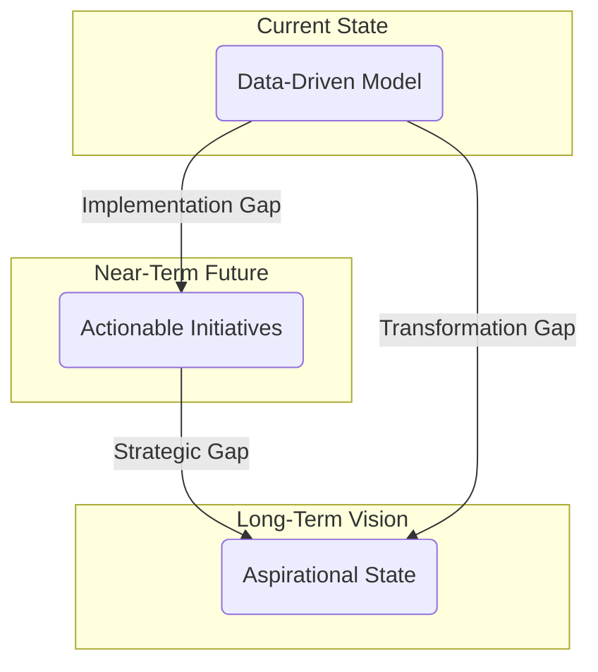

---
# ═══════════════════════════════════════════════════════════════════
# GROUP 0: ARCHITECTURAL POSITION (The Gravity Well)
# ═══════════════════════════════════════════════════════════════════
orbital_layer: 2
sector: "Universal"
gravitational_hubs: []
id: pat_01khm0d9wbxda6z368ye0kykns
slug: time-sliced-specification
title: Time-Sliced Specification
aliases:
- Multi-Horizon Planning
- Temporal Modeling
- Evolutionary Architecture
summary: A pattern for maintaining multiple, simultaneous temporal models of a system (Now, Next, Horizon) to enable systematic comparison, reveal strategic gaps, and guide evolutionary development.
context_labels:
  corporate: Strategic Roadmap Horizons
  government: Multi-Horizon Policy Design
  activist: Campaign Phase Planning
  tech: Evolutionary System Architecture
  community: Community Visioning Stages
ontology:
  domain: strategy
  cross_domains:
  - governance
  - systems-thinking
  - architecture
  commons_domain:
    - commons-engineering
  specification_layer: L4
  search_hints:
    primary_tension: Present Urgency vs. Future Relevance
    vector_keywords:
    - roadmap
    - evolution
    - strategic planning
    - temporal modeling
    - gap analysis
    - horizon planning
    - future state
  commons_assessment:
    stakeholder_architecture: 4
    value_creation: 5
    resilience: 4
    ownership: 3
    autonomy: 3
    composability: 5
    fractal_value: 4
    vitality: 4.5
    vitality_reasoning: >-
      This pattern creates a living, breathing model of strategy that connects the present to a desired future. By making temporal gaps explicit, it provides the essential feedback loops for a system to learn, adapt, and evolve its structure with intention. It fosters a sense of coherence and direction, allowing the organization to navigate uncertainty not as a threat, but as a landscape of possibility.
    overall_score: 4.1
lifecycle:
  usage_stage: design
  adoption_stage: growth
  status: draft
  version: 1.0
  confidence: 3
relationships:
  enables:
  - id: gap-analysis
    weight: 0.9
    description: Time slices reveal gaps between the current state (Now), the near-term future (Next), and the long-term vision (Horizon).
  - id: scenario-specification
    weight: 0.8
    description: The Horizon timeslice provides a concrete temporal frame for developing and evaluating long-term scenarios.
  complementary:
  - id: scenario-specification
    weight: 0.8
    description: Scenarios inform the aspirational state modeled in the Horizon timeslice, while the timeslice structure provides a framework for acting on scenario insights.
  requires:
  - id: scenario-specification
    weight: 0.8
    description: Required by scenario-specification (symmetric to enables relationship)
  generalizes_from:
  - commons-blueprint
  specializes_to:
  - scenario-specification
  - transformation-sequencing
graph_garden:
  last_pruned: '2026-02-16'
  entities:
  - First Principles
  - Resilience
  communities:
  - capability-and-structure
  - governance-and-trust
  inferred_links: []
contributors:
- higgerix
- cloudsters
license: CC-BY-SA-4.0
attribution: commons.engineering by cloudsters
provenance:
  contributors:
  - higgerix
  - cloudsters
---

### 1. Context

Practitioners in any complex endeavor, from corporate strategists to urban planners and software architects, constantly face the challenge of reconciling long-term vision with immediate operational demands. Organizations often operate in a state of temporal dissonance, where the five-year strategic plan feels like a dead artifact, disconnected from the urgent, living realities of the current quarter or sprint. The long-term vision provides direction but lacks immediate actionability, while short-term plans are concrete but risk becoming myopic, optimizing for local efficiencies at the expense of the overall strategic trajectory. This disconnect creates a significant gap in understanding and execution; the path from the current state to the desired future remains an unmapped territory, discussed in abstract terms but rarely modeled with rigor. Traditional annual planning cycles attempt to bridge this divide, but their output is typically a static document that quickly becomes obsolete in a volatile environment, lacking the pulse of life. Conversely, purely agile methods, while excellent at adapting to change, can lead to a random walk, where the organization drifts without a coherent, long-term narrative. The fundamental challenge is to create a living model of strategy that is both grounded in present reality and dynamically steering toward a desired future, allowing the system to breathe.

### 2. Problem

> **The core conflict is Present Urgency vs. Future Relevance.**

This tension manifests through several competing forces that pull an organization in different directions, making it difficult to maintain strategic coherence and vitality over time.

1.  **Force 1: Actionability vs. Vision.** Near-term plans, such as quarterly objectives or sprint backlogs, are tangible and immediately actionable. They provide clear direction for teams and create a sense of progress. However, an exclusive focus on these immediate tasks can lead to strategic drift, where the organization loses sight of its long-term vision, a ghost in the machine of daily operations. Conversely, a compelling long-term vision is inspiring and provides a North Star, but it often feels abstract and disconnected from the day-to-day work, making it difficult to translate into concrete actions.

2.  **Force 2: Certainty vs. Possibility.** The present is characterized by a high degree of certainty; we have data, metrics, and direct experience of the current state. Planning based on this known reality feels safe and reliable. The future, however, is inherently uncertain and filled with a spectrum of possibilities. Engaging with this uncertainty is essential for innovation and long-term resilience, but it requires a speculative mindset that can feel uncomfortable and risky compared to the solid ground of the present. A system that cannot dream beyond the known is a system that cannot truly live.

3.  **Force 3: Stability vs. Adaptability.** Stakeholders, including investors, employees, and customers, require a degree of stability and predictability. They need to know what to expect from the organization in the near term. However, the external environment is in constant flux, demanding that the organization be highly adaptable to survive and thrive. The need to provide stable commitments often conflicts with the need to pivot in response to new information, creating a tension between being reliable and being responsive. A living system must find a rhythm between structure and flow.

4.  **Force 4: Resource Allocation: Exploitation vs. Exploration.** Organizations must allocate finite resources—time, money, and talent—between exploiting existing, proven business models and exploring new, uncertain opportunities. The pressure for short-term returns often prioritizes investment in exploitation, which is more predictable and has a clearer ROI. This can starve the exploration of new ideas that are critical for future relevance and long-term growth, a classic dilemma known as the “innovator’s dilemma.” This choice is akin to a forest deciding whether to grow its existing trees taller or to allow new seeds to sprout.

### 3. Solution

> **Therefore, maintain three co-existing, structurally identical temporal models of the same system—Now, Next, and Horizon—to make strategic gaps explicit and actionable, giving the system a way to sense and respond to its own evolution.**

The solution is to move from a linear, static planning process to a dynamic, multi-layered view of the system over time. Instead of a single plan, you maintain three distinct but interconnected specifications, each representing the system at a different temporal horizon. The critical principle is that all three models share the exact same underlying ontology and structure, allowing for direct, systematic comparison. This shared structure provides a coherent vessel for the system's memory and imagination.

1.  **The Now Slice (The Baseline):** This is a high-fidelity, data-driven model of the system as it exists today. It is the verifiable "ground truth," continuously updated with real operational data. This is not a static snapshot but a living representation, ideally maintained through automated data feeds. It answers the question: "Where are we, really?"

2.  **The Next Slice (The Bridge):** This model describes the intended state of the system in the near-term future, typically 6 to 24 months out. It is concrete and actionable, containing defined initiatives, allocated resources, and clear responsibilities. The Next slice serves as the crucial bridge between today's reality and long-term aspiration, translating strategic goals into a tangible plan of execution. It answers the question: "Where are we going next?"

3.  **The Horizon Slice (The Vision):** This is a model of the aspirational, desired future state of the system, typically 5 to 10 years out. It is more speculative and directional, shaped by long-term vision, scenario analysis, and first principles. It is not a prediction but a guiding star, providing a coherent direction for the system's evolution and expressing its deepest purpose. It answers the question: "Where do we ultimately want to be?"

The true power of this pattern emerges from the systematic comparison between the slices, which turns abstract strategic discussions into concrete gap analyses.

By comparing **Now vs. Next**, the organization identifies immediate implementation gaps—the precise work needed to move from the current state to the planned future. Comparing **Next vs. Horizon** reveals strategic gaps, highlighting where the near-term plan may be misaligned with the long-term vision, prompting course correction. Finally, comparing **Now vs. Horizon** makes the full magnitude of the required transformation visible, providing a powerful tool for communicating the strategic journey to all stakeholders. This continuous process of modeling and comparison resolves the core tension by creating a direct, traceable, and living link between present actions and future relevance.

### 4. Implementation

Implementing Time-Sliced Specification is a structured process that requires discipline and a commitment to maintaining the integrity of the three distinct temporal models. It is the practice of tending to the organization's timeline as a living garden.

1.  **Step 1: Establish the "Now" Slice (The Baseline).** This is the most critical step. The "Now" slice must be an objective, data-driven representation of the current system. This involves cataloging all relevant components of the system and populating the model with current, accurate data. The key is to create a foundational layer of "ground truth" that is trusted by all stakeholders. This model must reflect reality, not aspirations; it is the soil from which all future growth emerges.

2.  **Step 2: Define the "Horizon" Slice (The Vision).** With a clear baseline, the next step is to define the long-term aspirational future. This is a directional model of the desired state in 5-10+ years, informed by methods like scenario analysis and trend forecasting. The Horizon slice should model the same entities as the Now slice but with their desired future attributes. This is where the organization gives form to its deepest hopes.

3.  **Step 3: Derive the "Next" Slice (The Bridge).** The "Next" slice is derived by working backward from the Horizon and forward from the Now. It answers the question: "What must we achieve in the next 6-24 months to be on a viable path toward our Horizon?" This slice is concrete and actionable, detailing specific initiatives and projects. This is where strategic choices are made and resources are allocated, giving the vision hands and feet.

4.  **Step 4: Systematically Compare Slices and Identify Gaps.** With all three slices populated, the core of the pattern is the systematic comparison of the models:
    *   **Now vs. Next:** Reveals the **Implementation Gap**. These are the immediate projects, process changes, and capability uplifts required. This comparison drives the operational plan.
    *   **Next vs. Horizon:** Reveals the **Strategic Gap**. This highlights where the near-term plan may be insufficient or misaligned with the long-term vision, prompting a re-evaluation of the Next slice.
    *   **Now vs. Horizon:** Reveals the **Transformation Gap**. This provides a powerful visualization of the total journey the organization must undertake, which is invaluable for communication and stakeholder alignment.

5.  **Step 5: Plan and Prioritize Initiatives.** The identified gaps are the raw material for the strategic and operational plan. Each gap should be converted into a well-defined initiative with an owner, budget, and timeline. This is how the system heals its own divisions.

6.  **Step 6: Institute a Rolling Cadence.** The slices are not static. A regular cadence for updating and rolling the models forward is essential, creating a rhythm for the organization's life:
    *   **Now:** Updated continuously or near-continuously as new data becomes available.
    *   **Next:** Reviewed and updated on a quarterly basis, with completed initiatives being absorbed into the Now slice.
    *   **Horizon:** Revisited annually or in response to significant external disruptions to ensure it remains a relevant and inspiring guide.

**Common Pitfalls:**
*   **Treating Slices as Predictions:** The Next and Horizon slices are models, not forecasts. They are tools for thinking and alignment, not attempts to predict the future.
*   **Letting the "Now" Slice Go Stale:** An out-of-date baseline makes all comparisons meaningless. The integrity of the Now slice is paramount; a system that cannot sense itself cannot live.
*   **The "Hollow Middle":** A common failure mode is to have a strong Now and an inspiring Horizon but a weak or non-existent Next slice, creating a vision without a bridge to reality. This leaves a void where the system's soul should be.
*   **Inconsistent Models:** If the three slices do not use the same underlying structure and entities, comparison becomes impossible. The discipline of structural consistency is non-negotiable.

### 5. Consequences

Adopting the Time-Sliced Specification pattern fundamentally changes how an organization perceives and interacts with time, strategy, and execution. It can infuse the entire system with a sense of purpose and direction. While powerful, the approach comes with its own set of benefits and liabilities that must be carefully managed.

**Benefits:**

*   **Makes Gaps Explicit:** The pattern transforms vague strategic challenges into a concrete, prioritized list of gaps. This clarity is a powerful catalyst for action, focusing resources on the most critical areas needing change or innovation. It makes the path to wholeness visible.
*   **Enables Evolutionary Change:** By breaking down a massive transformation (Now vs. Horizon) into manageable near-term steps (Now vs. Next), the pattern allows for a continuous, evolutionary approach to change, which is often more successful and less disruptive than large, infrequent "big bang" reorganizations. The system learns to adapt gracefully.
*   **Creates a Shared Language:** The Now, Next, and Horizon concepts provide a simple, powerful vocabulary for all stakeholders to discuss the future. This shared language aligns teams and leadership, ensuring that everyone is working from the same mental model of the organization's trajectory. Practitioners feel a sense of agency and belonging within this shared story.

**Liabilities:**

*   **Maintenance Overhead:** Without a high degree of automation, maintaining three distinct, structurally identical models can be resource-intensive. The primary challenge is keeping the "Now" slice continuously updated and ensuring the integrity of all three models over time. The garden requires tending.
*   **Potential for "Analysis Paralysis":** The systematic comparison of slices can generate an overwhelming number of identified gaps. Without a ruthless prioritization process, organizations can become paralyzed, endlessly analyzing gaps instead of acting to close them.
*   **Risk of Oversimplification:** The clean, structured nature of the models can mask the messy, complex reality of organizational dynamics. It is a tool for thinking and should not be mistaken for a perfect, deterministic simulation of the future. The map is not the living territory.

**When NOT to use this pattern:**

*   **Early-Stage Survival:** For a startup or an organization in a deep crisis, the only relevant timeslice is "Now." The focus must be entirely on immediate survival, and the overhead of maintaining Next and Horizon models would be a wasteful distraction.
*   **Highly Stable Environments:** If an organization operates in an extremely stable and predictable environment where the future is a simple extrapolation of the past, this pattern is likely overkill. A traditional, linear strategic plan may be sufficient.
*   **Lack of Disciplinary Commitment:** The pattern's success hinges on the organization's commitment to maintaining the models with rigor. If the culture does not support data-driven decision-making or the discipline to keep the "Now" slice accurate, the entire framework will quickly collapse and produce misleading results, becoming a dead letter.

### 6. Known Uses

This pattern, in various forms, is widely applied across different domains, demonstrating its versatility in bridging strategy and execution. It provides a vessel for organizational memory and foresight.

1.  **Corporate Strategy (McKinsey & Company):** The most famous application is McKinsey's Three Horizons of Growth model, which advises companies to manage a portfolio of initiatives across three horizons to ensure long-term viability. **Horizon 1** focuses on defending and extending the core business. **Horizon 2** involves building out emerging businesses that could be future growth engines. **Horizon 3** is dedicated to creating genuinely new, disruptive ventures. Companies like **Google (Alphabet)** implicitly use this model, with their core search business in Horizon 1, ventures like Waymo and Verily in Horizon 2/3, and speculative "moonshots" in Horizon 3. The outcome is a balanced portfolio that simultaneously exploits current strengths and explores future possibilities, allowing the corporate body to renew itself.

2.  **Agile Software Development (Scaled Agile Framework - SAFe):** The SAFe methodology incorporates the concept of "Investment Horizons" directly into its Lean Portfolio Management competency. The framework guides enterprises to allocate their budget across four horizons to balance near-term feature delivery with long-term innovation. **Horizon 1 (Investing and Extracting)** represents solutions that are profitable and have a significant market share. **Horizon 2 (Emerging)** includes promising new solutions that are gaining traction. **Horizon 3 (Evaluating)** is for exploring new ideas with small investments, and **Horizon 0 (Retiring)** is for decommissioning old systems. This approach helps large enterprises like **LEGO** and **American Express**, which use SAFe, to ensure that their agile development efforts are aligned with a long-term strategic perspective, preventing their many agile teams from pulling in different directions and instead fostering a coherent, living architecture.

3.  **Public Policy and Urban Planning (UK Government & Tactical Urbanism):** Governments and urban planners use multi-horizon thinking to connect long-term societal visions with short-term, actionable policies. The **UK Government's Policy Lab** explicitly uses the Three Horizons framework to help policymakers design for the future. They define a desired future state (Horizon 3), analyze the current system (Horizon 1), and then design a portfolio of experiments and transitional initiatives (Horizon 2) to navigate the path between them. In a more grassroots example, the **Tactical Urbanism** movement embodies this pattern by using short-term, low-cost interventions (e.g., pop-up bike lanes, temporary public plazas) as a form of rapid prototyping for long-term urban change. These small-scale "Now" experiments provide immediate value and serve as probes to test and refine the "Next" and "Horizon" plans for a city's evolution, allowing the city to learn and adapt from the ground up.

### 7. Cognitive Era Considerations

The cognitive era dramatically enhances the Time-Sliced Specification pattern, breathing new life into its implementation. What was a manual, often laborious process can now become a highly automated and intelligent function, closer to a biological nervous system.

**Automation of the "Now" Slice:** AI's most significant impact is automating the "Now" slice. Autonomous agents can continuously monitor and integrate data from various sources, transforming the "Now" slice into a live, real-time model. This increases the reliability of all comparisons and strategic conversations, giving the organization a powerful capacity for self-awareness.

**Enhanced Modeling and Simulation:** AI can create more sophisticated "Next" and "Horizon" slices. These can be probabilistic simulations, using techniques like Monte Carlo simulations to assess outcomes and risks. Generative AI can help visualize future scenarios, clarifying the long-term vision and making it feel more tangible and alive.

**Intelligent Gap Analysis and Anomaly Detection:** AI can augment the comparison of slices. Agents can identify, categorize, and prioritize gaps, and even suggest initiatives. They can also monitor the system's trajectory against the "Next" slice, alerting stakeholders to deviations for rapid course correction, acting as an immune system response to strategic drift.

**New Risks and Human Judgment:** This automation introduces new risks. Over-reliance on AI models can reduce critical thinking and create a new form of algorithmic blindness. Human judgment remains essential for setting ethical boundaries, making strategic choices, and interpreting model outputs. Leadership's role shifts from direct control to stewarding an intelligent, automated system, ensuring it serves the organization's deepest purpose.

### 8. Vitality: The Quality Without a Name

When the Time-Sliced Specification pattern is working well, it infuses an organization with a palpable sense of direction and momentum. Strategy ceases to be a dead document gathering dust on a shelf; it becomes a living, breathing conversation that permeates every level of the system. Practitioners feel a profound sense of agency and purpose, as they can clearly see the through-line connecting their immediate, tangible work to the organization's long-term, aspirational vision. The system has a heartbeat—the steady, reliable cadence of updating the slices, which pumps new information, learning, and insight through the organizational body. Faced with the unexpected, such as a sudden market shift or a disruptive new technology, the organization does not panic or freeze. Instead, it turns to its living models, using the framework to assess the impact, adapt the ‘Next’ slice, and recalibrate its path forward with confidence and coherence. There is a feeling of wholeness, a resonance between the past, present, and future.

Conversely, the decay of this pattern leads to a state of fragmentation and aimlessness. The ‘Now’ slice grows stale, becoming a ghost in the machine that reflects a past reality and offers no reliable guidance. The ‘Horizon’ devolves into a distant, irrelevant fantasy, and the ‘Next’ slice—the critical bridge between reality and aspiration—collapses, leaving a void where the system’s soul should be. Teams may work diligently, but their efforts feel disconnected and meaningless, lost in a fog of strategic incoherence. The organization becomes rigid and brittle, incapable of responding to change. It is trapped in an eternal, stagnant present, lacking the living memory to handle novelty and the collective imagination to create its own future. The earliest warning sign is silence: when the slices are no longer debated, challenged, and updated, the strategic conversation has died, and the organization is flying blind.
